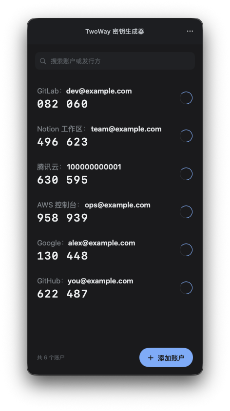
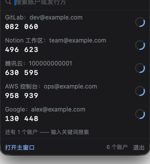

<p align="center">
  
</p>

<h1 align="center">2way</h1>

<p align="center">macOS 原生 TOTP 验证器 —— 竖向窄窗、一键取码、左滑管理、离线加密存储</p>

<p align="center">
  
  &nbsp;&nbsp;
  
</p>

对标 Google Authenticator 的操作心智做的一个轻量桌面验证器：验证码一眼可读、单击整行即复制、所有密钥只以密文落盘、全程离线无网络请求。

- 窗口 **360 × 732**，深色单列，适合常驻屏幕一侧
- **点按行 = 复制**（1 步完成，不开任何页面）
- **左滑行** 露出「编辑｜删除」；删除**就地二次确认**，不跳转
- **按住行竖直拖动可排序**（顺序持久化，重启与状态栏下拉同步；搜索过滤时自动禁用以免落位歧义）
- **状态栏常驻**：点菜单栏图标弹下拉，默认列 5 条、输入关键词搜索全部，回车复制首条
- 添加账户三条路：**导入二维码图片**（PNG / JPEG / HEIC）· **手动输入密钥** · **导入 Google Authenticator 迁移码**（`otpauth-migration://`，多账户批量）
- **加密备份**（口令派生密钥，AES-256-GCM）/ **导出 GA 迁移码 PNG**（可迁移到手机 GA）
- 复制后 **30 秒自动清除剪贴板**（仅当剪贴板仍归本应用所有，绝不误清你后来复制的内容）
- 可「**隐藏 Dock 图标**」，只留菜单栏（⌘, 或主窗口「⋯」→「偏好设置…」）
- 窗口无系统 chrome（交通灯已移除）：**⌘W 关闭窗口**（App 仍驻留菜单栏）、**⌘Q 退出**（主窗口激活时第一次会浮出「按住 ⌘Q 键即可退出」提示，2.5s 内再按一次即退出；状态栏面板与菜单里的「退出」为显式操作、直接生效）、标题栏空白处可拖动窗口
  - 注意：窗口关闭后（仅菜单栏驻留）macOS 不再向应用派发按键，此时请用状态栏面板里的「退出」

## 安全模型（重要，请按实际需求评估）

| 项 | 现状 |
|---|---|
| 密钥存储 | `~/Library/Application Support/2way/wallet.bin`：**AES-256-GCM 认证加密**，密钥独立文件 `master.key`（32 字节随机，0600），目录 0700；原子替换写入 |
| 明文落盘 | 无。密钥仅在内存与密文文件中流转 |
| 日志 / 崩溃信息 | 源码零 `print` / `os_log` / `Logger`；`Account` 的调试描述显式脱敏 |
| 剪贴板 | 默认 30 秒后自动清除（S4）；仍归本应用所有时才清 |
| 权限 | **不申请摄像头**（二维码只走图片导入）、无辅助功能、无网络请求 |
| 已知降级 | 不抗「以同一用户身份运行的本地攻击者」—— 主密钥与本进程同权限可读。**主密钥丢失即无法解密**，逃生通道是加密备份文件（口令派生，不依赖主密钥） |

> 若你需要 Keychain 级别的 ACL 保护，请先阅读 `TECH_PLAN.md` 的 D9 决策记录：本机环境下钥匙串条目 ACL 不自动信任创建者，逐条读密钥都会弹一次系统授权框，与「一键取码」的心智冲突，故改为应用自管加密文件。

## 系统要求

- macOS **14.0+**（`MenuBarExtra`、`@Environment(\.openSettings)` 等 API 的最低版本）
- 从源码构建：Xcode 16+（Swift 6）、[xcodegen](https://github.com/yonaskolb/XcodeGen)

## 安装

**方式一：DMG**

```bash
bash scripts/release-package.sh      # 产出 dist/2way-1.0.3.dmg
```

打开 DMG 把 `2way.app` 拖入「应用程序」。产物使用**自签名证书**签名（`scripts/create-signing-cert.sh` 创建），无法通过公证：

- 本机构建的产物无 quarantine 属性，可直接运行；
- 经 AirDrop / 网盘传到其它机器会被 Gatekeeper 隔离 → 右键「打开」，或 `xattr -dr com.apple.quarantine /Applications/2way.app`。

**方式二：源码运行**

```bash
xcodegen generate
xcodebuild -project TwoWay.xcodeproj -scheme TwoWay -configuration Debug build
open ~/Library/Developer/Xcode/DerivedData/TwoWay-*/Build/Products/Debug/2way.app
```

## 开发

```bash
xcodegen generate                                   # 新增文件后必须执行（project.yml 是唯一事实来源）
xcodebuild -project TwoWay.xcodeproj -scheme TwoWay -configuration Debug test
bash scripts/release-package.sh                     # 归档 → 重签 → DR 校验 → DMG → 挂载实测
bash scripts/sync-appicon.sh                        # 更新图标后同步（actool 只读 Asset Catalog）
```

**测试**：170 个用例（Swift Testing），覆盖 TOTP 引擎（RFC 6238 附录 B 全向量）、Base32、otpauth / GA 迁移码解析、备份格式与幂等导入、左滑状态机、加密存储、剪贴板守卫、状态栏选取逻辑、偏好设置与窗口尺寸解析。UI 层走手工回归（清单在 `TASK_BOARD.md`）。

### 目录结构

```
Sources/
├─ App/            # 入口、窗口配置、根视图与路由、启动引导、取证探针
├─ Domain/         # Account / OTPParameters（不含密钥）
├─ Services/       # TOTP 引擎、Base32、otpauth 与迁移码解析、二维码编解码、
│                  # 加密存储、备份格式、剪贴板守卫与自动清除
├─ State/          # AccountStore（单一数据源）、SwipeRowModel、AppRouter、
│                  # AppSettings、ManualEntryModel、状态栏选取逻辑
├─ Features/       # AccountList / AddAccount / Backup / MenuBar / Settings
├─ DesignSystem/   # Token（颜色·尺寸·动效）+ 基础组件
└─ Resources/      # Assets.xcassets（App 图标、状态栏 template 图标）
Tests/TwoWayTests/ # 19 个测试文件（Services / Domain / State 层）
scripts/           # 打包、签名、图标同步、几何实测脚本
```

### 调试启动参数（仅 DEBUG 构建生效）

| 参数 | 用途 |
|---|---|
| `--width <pt>` | 覆盖窗口宽度（260–420），用于宽度比选 |
| `--debug-add` / `--debug-import` / `--debug-edit` | 直进添加页 / 导入页 / 编辑页 |
| `--debug-import-file <png>` | 启动即走「解码 → 解析 → 入库」真实链路 |
| `--debug-delete-dialog` / `--debug-open-row` | 直开删除确认弹窗 / 强制展开首行 |
| `--debug-menubar` / `--debug-menubar-query <kw>` | 打开状态栏面板预览窗 / 预设搜索词 |
| `--debug-settings` / `--debug-toast` | 打开偏好设置 / 渲染一条 toast |
| `--scroll-probe <json>` | 自报所有 `NSScrollView` 几何（滚动条取证） |
| `--row-trace <log>` | 自报行偏移/展开态与切屏时序（瞬态取证） |
| `--slow-transition <s>` + `--list-transition-opacity` | 放慢切屏 + A/B 复现过渡期合成问题 |
| `--debug-flip-screens [--flip-interval <s>]` | 自驱列表 ↔ 添加页往返（复现切屏瞬态） |
| `--debug-reorder-drag` / `--debug-drag-script` | 注入「拖动中」状态（截图用）/ 脚本化拖动（自报落点序列、回翻数、tick 偏差） |
| `--debug-drag-trace` | 逐个鼠标事件自报拖动位移（含 `start`/`location`）—— 排查「拖动抖动」类问题 |
| `--debug-close-window` | 启动后关闭主窗口一次（回归「状态栏 → 打开主窗口」的关闭态） |

## 文档

| 文件 | 作用 |
|---|---|
| [`PRD.md`](PRD.md) | 产品需求：页面清单、交互规则（R1–R11）、边界与异常（E1–E11）、安全与性能指标、验收清单 |
| [`TECH_PLAN.md`](TECH_PLAN.md) | 技术方案：架构分层、决策记录（D1–D10）、任务卡与验收判据、风险登记 |
| [`TASK_BOARD.md`](TASK_BOARD.md) | 任务板：逐卡状态、完成判据、变更记录、风险与待办 |
| [`index.html`](index.html) | 可交互原型（单文件，内置真实 RFC 6238 计算，验证码为实时值） |

## 已知限制

- **HOTP（计数器型）不支持**：导入迁移码时若含 HOTP 账户会**跳过并明确提示**，不静默丢弃。
- 主密钥丢失只能靠**加密备份文件**恢复（口令派生），请定期导出备份。
- 自签名证书**无法公证**，首次在其它机器运行需手动放行。
- 不做的事（决策记录见 PRD §4 / v1.3）：触控板双指横滑、全局快捷键、摄像头扫码、系统级搜索取码；`index.html` 原型画布仍为 400×700，与 App 的 360×732 有宽度差，作视觉基准时需换算。

## 许可

本项目没有任何许可，随意转发
